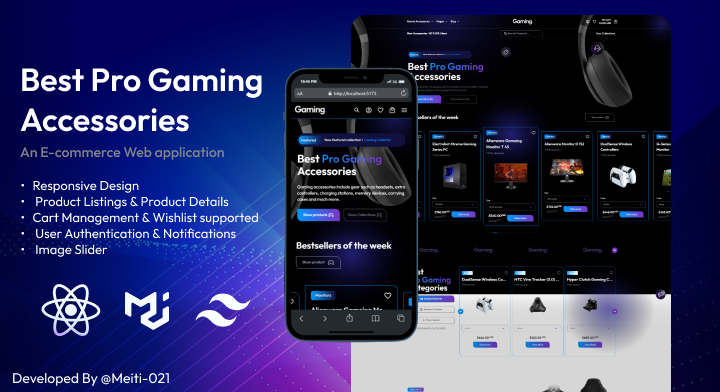

# Gaming E-commerce Front-End Project

This is an advanced front-end project for a gaming e-commerce website, built using React, Tailwind CSS, Material-UI, Swiper.js, and Notistack libraries. The project is fully responsive, user-friendly, and developed by Mahdi Dehgani, an intermediate front-end developer.

## Project Overview

The gaming e-commerce front-end project aims to create an engaging and intuitive user experience for an online gaming store. The website showcases various gaming products, allows users to browse through different categories, view product details, add items to their cart, and proceed with the checkout process.

## Features

- Responsive Design: The website is designed to provide a seamless experience across different devices and screen sizes.
- Home Page: Displays featured gaming products, popular categories, and promotional offers.
- Product Listings: Allows users to browse and filter gaming products based on categories, price range, and other criteria.
- Product Details: Provides detailed information about each gaming product, including images, descriptions, specifications, and customer reviews.
- Cart Management: Enables users to add products to their cart, update quantities, and remove items.
- Checkout Process: Guides users through the steps required to complete their purchase, including shipping information, payment options, and order confirmation.
- User Authentication: Allows users to create accounts, log in, and manage their profile information.
- Notifications: Utilizes the Notistack library to display non-intrusive notifications to users, such as successful actions or error messages.
- Image Slider: Implements the Swiper.js library to create an interactive and visually appealing image carousel for featured products or banners.

## Technologies Used

- React: A JavaScript library for building user interfaces.
- Tailwind CSS: A utility-first CSS framework for rapidly styling the application.
- Material-UI: A popular UI component library that offers ready-to-use components following the Material Design guidelines.
- Swiper.js: A modern JavaScript slider library for creating image carousels and sliders.
- Notistack: A library for displaying notifications or snackbars in a non-obtrusive manner.
- Vite: A fast and lightweight development server that powers the project.

## Installation and Usage

1. Clone the repository: `git clone https://github.com/mahdi-dehgani/gaming-ecommerce-project.git`
2. Navigate to the project directory: `cd gaming-ecommerce-project`
3. Install dependencies: `npm install`
4. Start the development server: `npm run dev`
5. Open the project in your preferred web browser: `http://localhost:5173`

Feel free to explore the different pages, interact with the features, and test the responsiveness on various devices.

## Contact Information

- Developer: Mahdi Dehgani
- Email: meiti.edu@gmail.com

## License

This project is licensed under the [MIT License](LICENSE).

## Acknowledgments

- Special thanks to the creators and contributors of React, Tailwind CSS, Material-UI, Swiper.js, Notistack, and Vite for their amazing tools and libraries that helped make this project possible.

## Additional Notes

Please note that this project is solely for demonstration and portfolio purposes. It does not include backend functionality or real payment processing.
